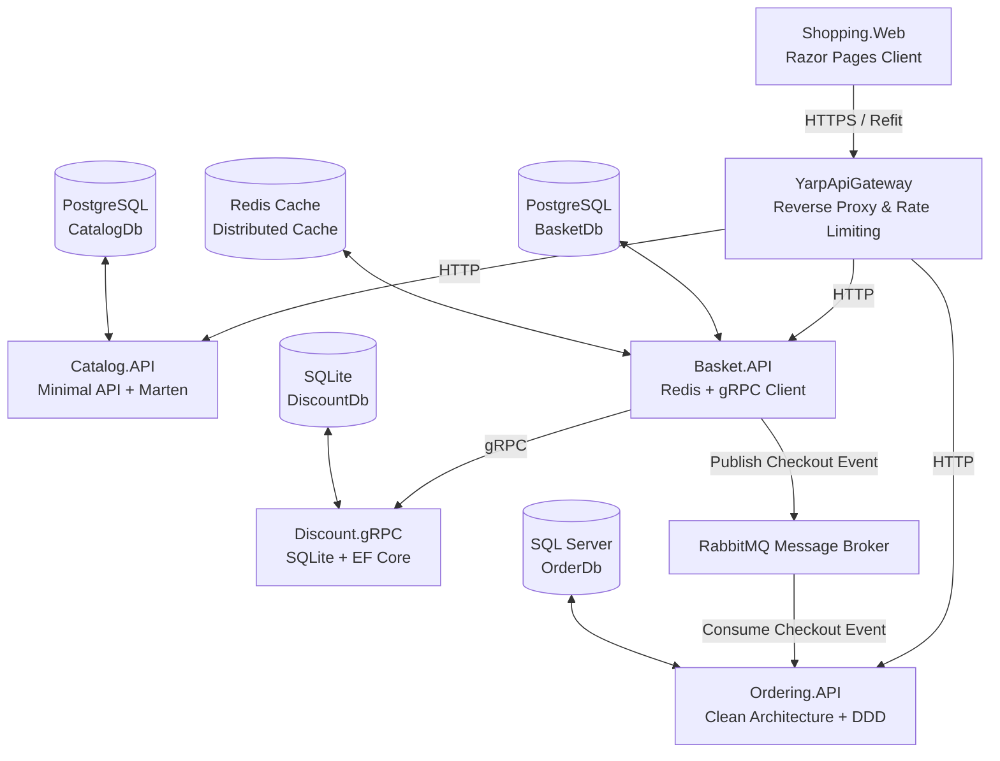

# 🛒 eShopMicroservice - Enterprise Microservices Architecture with .NET 8

[](https://dotnet.microsoft.com/)
[](https://www.docker.com/)
[](https://www.postgresql.org/)
[](https://www.microsoft.com/sql-server)
[](https://redis.io/)
[](https://www.rabbitmq.com/)

Hệ thống ứng dụng thương mại điện tử **eShopMicroservice** được thiết kế và phát triển dựa trên kiến trúc **Microservices** hiện đại sử dụng **.NET 8**, áp dụng các mô hình thiết kế phần mềm tiên tiến như **CQRS**, **Domain-Driven Design (DDD)**, **Clean Architecture**, **Event-Driven Architecture**, **API Gateway (YARP)**, **gRPC** và **Distributed Caching**.

---

## 🏗 Kiến Trúc Hệ Thống (System Architecture)

Dự án bao gồm các dịch vụ độc lập được đóng gói bằng Docker Containers và phối hợp hoạt động thông qua API Gateway & Event Bus:



---

## 🧩 Các Thành Phần Chính (Components & Microservices)

### 1. 🏬 Catalog.API
- **Chức năng**: Quản lý danh mục sản phẩm (CRUD, phân trang, lọc sản phẩm theo category).
- **Công nghệ**: Minimal APIs với **Carter**, **CQRS** qua **MediatR**, Document Database với **Marten** trên **PostgreSQL**, **FluentValidation**, **Health Checks**.

### 2. 🛒 Basket.API
- **Chức năng**: Quản lý giỏ hàng người dùng, áp dụng mã giảm giá, thực hiện Checkout đơn hàng.
- **Công nghệ**: **Marten** (PostgreSQL), **Redis Cache** (Distributed Caching), **gRPC Client** gọi tới `Discount.gRPC`, **MassTransit** giao tiếp bất đồng bộ qua **RabbitMQ**.

### 3. 🏷 Discount.gRPC
- **Chức năng**: Dịch vụ tính toán và quản lý mã giảm giá hiệu năng cao qua gRPC.
- **Công nghệ**: **gRPC Service**, **Entity Framework Core**, **SQLite**.

### 4. 📦 Ordering.API
- **Chức năng**: Quản lý đơn hàng, xử lý sự kiện đặt hàng từ giỏ hàng.
- **Công nghệ**: **Clean Architecture** (Domain, Application, Infrastructure, API), **Domain-Driven Design (DDD)** (Aggregates, Entities, Value Objects, Domain Events), **CQRS** (MediatR), **EF Core** với **SQL Server**, **MassTransit RabbitMQ Consumer**, **Feature Management**.

### 5. 🚪 YarpApiGateway
- **Chức năng**: Đóng vai trò làm điểm truy cập duy nhất (Single Entry Point) điều hướng request từ giao diện WebApp đến các Microservices backend.
- **Công nghệ**: **YARP (Yet Another Reverse Proxy)**, Rate Limiting Policy, Path Transformations.

### 6. 🌐 Shopping.Web
- **Chức năng**: Giao diện người dùng web ứng dụng thương mại điện tử.
- **Công nghệ**: **ASP.NET Core Razor Pages**, **Refit** (Typed REST Client), Bootstrap UI.

### 7. 🧰 BuildingBlocks & BuildingBlocks.Messaging
- **Chức năng**: Thư viện dùng chung cho toàn bộ solution.
- **Tính năng**: 
  - `BuildingBlocks`: CQRS interfaces (`ICommand`, `IQuery`), MediatR Pipeline Behaviors (`ValidationBehavior`, `LoggingBehavior`), Custom Exceptions & Centralized Exception Handler.
  - `BuildingBlocks.Messaging`: Định nghĩa các Integration Events (`BasketCheckoutEvent`) và tích hợp MassTransit + RabbitMQ.

---

## 🛠 Công Nghệ & Thư Viện Sử Dụng (Tech Stack)

| Hạng mục | Công nghệ / Thư viện |
| :--- | :--- |
| **Framework** | .NET 8 (C#) |
| **Architecture** | Microservices, CQRS, Domain-Driven Design (DDD), Clean Architecture, Event-Driven |
| **Databases** | PostgreSQL, SQL Server, SQLite |
| **Caching** | Redis (StackExchange.Redis) |
| **Messaging / Event Bus** | RabbitMQ, MassTransit |
| **Communication** | REST API (Carter Minimal APIs), gRPC, Refit Client, YARP Gateway |
| **Data Access** | Marten (Document DB), Entity Framework Core |
| **Validation & Logging** | FluentValidation, MediatR Open Behaviors |
| **Containerization** | Docker, Docker Compose |

---

## 🔌 Danh Sách Cổng & Dịch Vụ (Port Mappings)

Khi khởi chạy với Docker Compose (`docker-compose.override.yml`), các cổng dịch vụ được ánh xạ như sau:

| Dịch vụ / Container | Cổng Host (HTTP) | Cổng Host (HTTPS) | Mô tả / Dashboard |
| :--- | :--- | :--- | :--- |
| **Shopping.Web** | `6005` | `6065` | Giao diện Web Client (`http://localhost:6005`) |
| **YarpApiGateway** | `6004` | `6064` | API Gateway (`http://localhost:6004`) |
| **Catalog.API** | `6000` | `6060` | Catalog Service API |
| **Basket.API** | `6001` | `6061` | Basket Service API |
| **Discount.gRPC** | `6002` | `6062` | Discount gRPC Service |
| **Ordering.API** | `6003` | `6063` | Ordering Service API |
| **RabbitMQ** | `5672` | `15672` | Management Console: `http://localhost:15672` (guest/guest) |
| **PostgreSQL Catalog** | `5432` | - | PostgreSQL Database cho Catalog API |
| **PostgreSQL Basket** | `5433` | - | PostgreSQL Database cho Basket API |
| **SQL Server Order** | `1434` | - | SQL Server Database cho Ordering API |
| **Redis Cache** | `6379` | - | Distributed Cache |

---

## 🚀 Hướng Dẫn Chạy Ứng Dụng (Getting Started)

### Yêu Cầu Tiền Đề (Prerequisites)
- [.NET 8 SDK](https://dotnet.microsoft.com/download/dotnet/8.0)
- [Docker Desktop](https://www.docker.com/products/docker-desktop/)

### Các Bước Khởi Chạy Bằng Docker Compose

1. **Clone Repository**:
   ```bash
   git clone https://github.com/your-username/EShopMicroservice.git
   cd EShopMicroservice
   ```

2. **Chạy các container dịch vụ bằng Docker Compose**:
   ```bash
   cd src
   docker compose -f docker-compose.yml -f docker-compose.override.yml up -d --build
   ```

3. **Truy cập ứng dụng**:
   - 🌐 **Shopping Web App**: [http://localhost:6005](http://localhost:6005)
   - 🚪 **YARP API Gateway**: [http://localhost:6004](http://localhost:6004)
   - 🐇 **RabbitMQ Dashboard**: [http://localhost:15672](http://localhost:15672) *(Tài khoản/Mật khẩu: `guest` / `guest`)*

---

## 🔧 Xử Lý Lỗi SSL Certificate Trong Môi Trường Dev

Trong môi trường local/Docker, các giao tiếp HTTPS nội bộ giữa dịch vụ có thể gặp lỗi `RemoteCertificateNameMismatch` hoặc `RemoteCertificateChainErrors`.

Dự án đã cấu hình bỏ qua kiểm tra SSL Dev Certificate cho các HTTP/gRPC Client trong môi trường phát triển. Nếu chạy ứng dụng trực tiếp trên máy host (ngoài Docker), bạn có thể trust dev-cert bằng cách chạy:

```bash
dotnet dev-certs https --clean
dotnet dev-certs https --trust
```

---

## 📝 Giấy Phép (License)

Dự án được phân phối dưới giấy phép [MIT License](LICENSE).