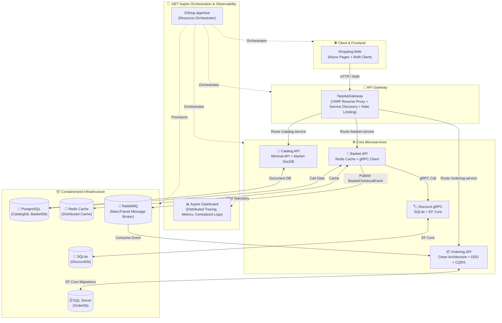

# 🛒 eShopMicroservice - Enterprise Microservices Architecture with .NET 10 & .NET Aspire

[](https://dotnet.microsoft.com/)
[](https://learn.microsoft.com/dotnet/aspire/)
[](https://www.docker.com/)
[](https://www.postgresql.org/)
[](https://www.microsoft.com/sql-server)
[](https://redis.io/)
[](https://www.rabbitmq.com/)
[](https://opentelemetry.io/)

Hệ thống ứng dụng thương mại điện tử **eShopMicroservice** là giải pháp mẫu chuẩn doanh nghiệp (Enterprise Architecture) được xây dựng trên nền tảng **.NET 10** và điều phối bằng **.NET Aspire**. Dự án áp dụng các mô hình kiến trúc phần mềm tiên tiến nhất hiện nay: **Clean Architecture**, **Domain-Driven Design (DDD)**, **CQRS**, **Event-Driven Architecture**, **API Gateway (YARP)**, **gRPC**, **Distributed Caching (Redis)**, **Document DB (Marten/Postgres)** và **Distributed Observability (OpenTelemetry)**.

---

## 📑 Mục Lục
- [🏗 Kiến Trúc Hệ Thống (System Architecture)](#-kiến-trúc-hệ-thống-system-architecture)
- [🧩 Các Thành Phần & Microservices](#-các-thành-phần--microservices)
- [🛠 Bảng Công Nghệ Sử Dụng (Tech Stack)](#-bảng-công-nghệ-sử-dụng-tech-stack)
- [🚀 Hướng Dẫn Khởi Chạy (Getting Started)](#-hướng-dẫn-khởi-chạy-getting-started)
  - [Cách 1: Khởi chạy bằng .NET Aspire (Khuyên dùng khi Dev/Debug)](#cách-1-khởi-chạy-bằng-net-aspire-khuyên-dùng-khi-devdebug-)
  - [Cách 2: Khởi chạy bằng Docker Compose](#cách-2-khởi-chạy-bằng-docker-compose)
- [🔌 Bảng Cổng Dịch Vụ (Port Mappings)](#-bảng-cổng-dịch-vụ-port-mappings)
- [📊 Khả Năng Giám Sát & Tracing (Observability)](#-khả-năng-giám-sát--tracing-observability)
- [🔧 Xử Lý Các Vấn Đề Thường Gặp (Troubleshooting)](#-xử-lý-các-vấn-đề-thường-gặp-troubleshooting)
- [📝 Giấy Phép (License)](#-giấy-phép-license)

---

## 🏗 Kiến Trúc Hệ Thống (System Architecture)

Hệ thống được điều phối toàn diện bằng **.NET Aspire AppHost**, quản lý các Container Backing Services và kết nối các Microservices qua Service Discovery:



---

## 🧩 Các Thành Phần & Microservices

### 1. 🚀 `Aspire/` - .NET Aspire Orchestrator & Defaults
- **`EShop.AppHost`**: Dự án khởi chạy trung tâm (Orchestrator). Định nghĩa và quản lý vòng đời của tất cả các container (`PostgreSQL`, `Redis`, `RabbitMQ`, `SQL Server`) và microservices, tự động phân giải cổng và inject biến môi trường kết nối.
- **`EShop.ServiceDefaults`**: Thư viện dùng chung cấu hình **OpenTelemetry** (Logging, Tracing, Metrics), **Health Checks** (`/health`, `/alive`), **Service Discovery** và **HTTP Client Resiliency** (Polly retry policies).

### 2. 🏬 `Catalog.API`
- **Chức năng**: Quản lý danh mục hàng hóa (CRUD, phân trang, lọc theo danh mục).
- **Công nghệ**: Minimal APIs với **Carter**, **CQRS** qua **MediatR**, Document Database sử dụng **Marten** trên **PostgreSQL**, **FluentValidation**.

### 3. 🛒 `Basket.API`
- **Chức năng**: Quản lý giỏ hàng người dùng (thêm, sửa, xóa, áp dụng voucher, checkout giỏ hàng).
- **Công nghệ**: **Marten** (PostgreSQL), **Redis Distributed Cache** (Cache-Aside pattern), **gRPC Client** kết nối tới `Discount.gRPC`, **MassTransit** publish `BasketCheckoutEvent` qua **RabbitMQ**.

### 4. 🏷 `Discount.gRPC`
- **Chức năng**: Xử lý mã giảm giá hiệu năng cao thông qua giao thức gRPC.
- **Công nghệ**: **gRPC Service**, **Entity Framework Core**, **SQLite**, Custom Interceptors.

### 5. 📦 `Ordering.API` & Ordering Modules
- **Chức năng**: Tiếp nhận và quản lý đơn hàng từ luồng Checkout giỏ hàng.
- **Cấu trúc Clean Architecture**:
  - `Ordering.Domain`: Entities, Aggregates, Value Objects, Domain Events.
  - `Ordering.Application`: CQRS Handlers (Commands/Queries), Data Mappings, Validators, Event Handlers.
  - `Ordering.Infrastructure`: Entity Framework Core với **SQL Server**, Interceptors (Audit, Domain Events Dispatcher), Database Migrations & Initial Seed Data.
  - `Ordering.API`: Minimal APIs với Carter, **MassTransit RabbitMQ Consumer** (`BasketCheckoutConsumer`), Feature Flags.

### 6. 🚪 `YarpApiGateway`
- **Chức năng**: Điểm tiếp nhận request tập trung (Reverse Proxy), điều hướng routing linh hoạt tới các Microservices nội bộ.
- **Công nghệ**: **YARP (Yet Another Reverse Proxy)**, **YARP Service Discovery Destination Resolver**, Rate Limiting.

### 7. 🌐 `Shopping.Web`
- **Chức năng**: Giao diện người dùng web ứng dụng thương mại điện tử.
- **Công nghệ**: **ASP.NET Core Razor Pages**, **Refit** (Typed HTTP REST Client), Bootstrap 5.

### 8. 🧰 `BuildingBlocks/`
- `BuildingBlocks`: Abstraction cho CQRS (`ICommand`, `IQuery`), MediatR Open Pipeline Behaviors (`ValidationBehavior`, `LoggingBehavior`), Centralized Exception Handling (`CustomExceptionHandler`).
- `BuildingBlocks.Messaging`: Định nghĩa Integration Events dùng chung (`BasketCheckoutEvent`) và cấu hình tiện ích cho MassTransit RabbitMQ.

---

## 🛠 Bảng Công Nghệ Sử Dụng (Tech Stack)

| Hạng mục | Công nghệ / Thư viện |
| :--- | :--- |
| **Framework & Runtime** | .NET 10 (C# 13/14) |
| **Orchestration & Dashboard** | **.NET Aspire (8.2+)**, Docker Desktop |
| **Kiến trúc phần mềm** | Microservices, Clean Architecture, DDD, CQRS, Event-Driven Architecture |
| **Observability & Tracing** | **OpenTelemetry**, Aspire Dashboard, Health Checks UI |
| **Cơ sở dữ liệu** | PostgreSQL 16 (Marten DocDB), SQL Server 2022, SQLite |
| **Caching** | Redis (StackExchange.Redis) |
| **Message Broker / Event Bus** | RabbitMQ, MassTransit |
| **Giao tiếp liên dịch vụ** | RESTful API (Carter Minimal APIs), gRPC, Refit Client, YARP Gateway |
| **Resilience & Fault Tolerance** | Microsoft Extensions Http Resilience (Polly), EF Core Retry Policy |
| **Validation & Mapping** | FluentValidation, Mapster |

---

## 🚀 Hướng Dẫn Khởi Chạy (Getting Started)

### Yêu Cầu Tiền Đề (Prerequisites)
- [.NET 10 SDK](https://dotnet.microsoft.com/download) hoặc mới hơn.
- [Docker Desktop](https://www.docker.com/products/docker-desktop/) (Đảm bảo Docker đang bật).

---

### Cách 1: Khởi chạy bằng .NET Aspire (Khuyên dùng khi Dev/Debug ⭐)

Với .NET Aspire, bạn không cần chạy lệnh `docker-compose` thủ công hay cấu hình multi-startup. Chỉ cần chạy 1 project `AppHost`:

1. **Clone repository**:
   ```bash
   git clone https://github.com/your-username/EShopMicroservice.git
   cd EShopMicroservice
   ```

2. **Chạy EShop.AppHost**:
   - **Bằng Visual Studio / Rider**: Đặt project `EShop.AppHost` làm **Startup Project** và nhấn **F5** (hoặc `Ctrl + F5`).
   - **Bằng .NET CLI**:
     ```bash
     dotnet run --project src/Aspire/EShop.AppHost/eShop.AppHost/eShop.AppHost.AppHost/eShop.AppHost.AppHost.csproj
     ```

3. **Mở Aspire Dashboard**:
   - Trình duyệt sẽ tự động mở trang Dashboard (ví dụ: `https://localhost:17015` hoặc `http://localhost:15015`).
   - Nhấn vào liên kết của `shopping-web` để trải nghiệm mua hàng và quan sát Trace thời gian thực!

---

### Cách 2: Khởi chạy bằng Docker Compose

Nếu muốn khởi chạy toàn bộ hệ thống dưới dạng các Container độc lập (dành cho kiểm thử đóng gói hoặc CI/CD):

```bash
cd src
docker compose -f docker-compose.yml -f docker-compose.override.yml up -d --build
```

---

## 🔌 Bảng Cổng Dịch Vụ (Port Mappings)

Khi khởi chạy với Docker Compose hoặc qua cổng mặc định:

| Dịch vụ / Container | Cổng HTTP | Cổng HTTPS | Địa chỉ truy cập / Dashboard |
| :--- | :---: | :---: | :--- |
| **🚀 Aspire Dashboard** | `15015` | `17015` | `https://localhost:17015` (Khi chạy Aspire) |
| **🌐 Shopping.Web** | `5005` / `6005` | `5055` / `6065` | `https://localhost:5055` |
| **🚪 YarpApiGateway** | `5004` / `6004` | `5054` / `6064` | `https://localhost:5054` |
| **🏬 Catalog.API** | `5000` / `6000` | `5050` / `6060` | `https://localhost:5050/swagger` |
| **🛒 Basket.API** | `5001` / `6001` | `5051` / `6061` | `https://localhost:5051/swagger` |
| **🏷️ Discount.gRPC** | `5002` / `6002` | `5052` / `6062` | gRPC Endpoint |
| **📦 Ordering.API** | `5003` / `6003` | `5053` / `6063` | `https://localhost:5053/swagger` |
| **🐰 RabbitMQ** | `5672` | `15672` | `http://localhost:15672` *(guest / guest)* |
| **🐘 PostgreSQL (Catalog)** | `5432` | - | Database Server |
| **🐘 PostgreSQL (Basket)** | `5433` | - | Database Server |
| **🗄️ SQL Server (Ordering)** | `1434` / `1433` | - | Database Server |
| **🔴 Redis Cache** | `6379` | - | Distributed Memory Cache |

---

## 📊 Khả Năng Giám Sát & Tracing (Observability)

Với sự hỗ trợ của **OpenTelemetry** và **.NET Aspire Dashboard**:
- **Distributed Tracing**: Theo dõi luồng dữ liệu liên dịch vụ end-to-end: `Shopping.Web` ➡️ `YarpApiGateway` ➡️ `Basket.API` ➡️ `Discount.gRPC` / `RabbitMQ` ➡️ `Ordering.API`.
- **Structured Logs**: Toàn bộ log của tất cả services được gom về một giao diện duy nhất, hỗ trợ lọc theo cấp độ (Information, Warning, Error) và Correlation ID.
- **Real-time Metrics**: Giám sát thời gian phản hồi HTTP, số lượng active connections, lượng RAM/CPU sử dụng.

---

## 🔧 Xử Lý Các Vấn Đề Thường Gặp (Troubleshooting)

### 1. Lỗi Marten Command Failure (`database does not exist`)
- **Nguyên nhân**: Container PostgreSQL mới chưa tạo database vật lý `CatalogDb` hoặc `BasketDb`.
- **Khắc phục**: Thêm cấu hình tự tạo Database trong `AddMarten` ở `Program.cs`:
  ```csharp
  opts.CreateDatabasesForTenantsIfNotExist(c => {
      c.ForTenant().CheckAgainstPgDatabase().WithOwner("postgres");
  });
  ```

### 2. Lỗi SQL Server Transient Failure / Win32Exception lúc khởi động
- **Nguyên nhân**: `Ordering.API` chạy migrate dữ liệu trước khi container SQL Server kịp khởi động xong.
- **Khắc phục**: Thêm `EnableRetryOnFailure` vào cấu hình EF Core trong `Ordering.Infrastructure/DependencyInjection.cs`:
  ```csharp
  options.UseSqlServer(connectionString, sqlOpts => {
      sqlOpts.EnableRetryOnFailure(maxRetryCount: 5, maxRetryDelay: TimeSpan.FromSeconds(10), errorNumbersToAdd: null);
  });
  ```

### 3. YarpApiGateway không phân giải được địa chỉ `http://catalog-api`
- **Nguyên nhân**: Thiếu bộ phân giải Service Discovery của YARP trong Aspire.
- **Khắc phục**: Thêm package `Microsoft.Extensions.ServiceDiscovery.Yarp` và gọi `.AddServiceDiscoveryDestinationResolver()` sau `AddReverseProxy().LoadFromConfig(...)`.

### 4. Lỗi SSL Certificate trong môi trường Local Dev
- Chạy lệnh sau trong Terminal để tin cậy lại chứng chỉ .NET Dev:
  ```bash
  dotnet dev-certs https --clean
  dotnet dev-certs https --trust
  ```

---

## 📝 Giấy Phép (License)

Dự án được phân phối dưới giấy phép mã nguồn mở [MIT License](LICENSE).