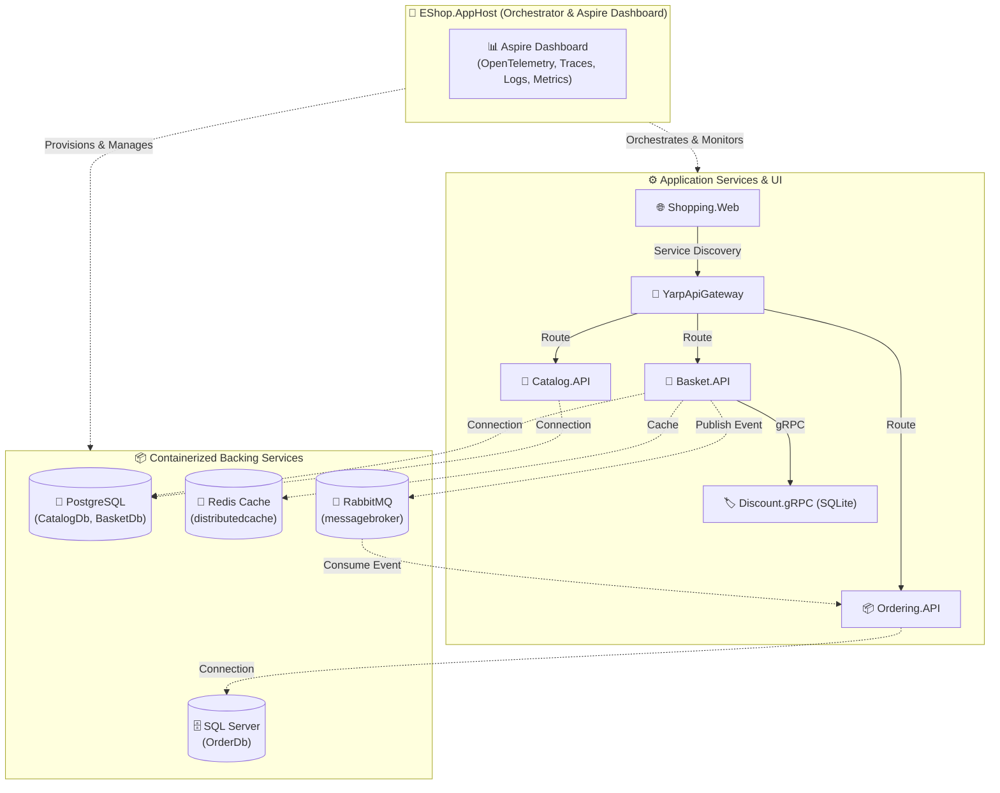

# 🚀 Hướng Dẫn Tích Hợp .NET Aspire vào eShopMicroservice

[](https://learn.microsoft.com/dotnet/aspire/)
[](https://opentelemetry.io/)
[](#)

Tài liệu này cung cấp kế hoạch và các bước chi tiết để tích hợp **.NET Aspire** vào dự án **eShopMicroservice**, giúp chuẩn hóa việc điều phối (Orchestration), Service Discovery, Quản lý cấu hình container và quan sát phân tán (Distributed Tracing, Metrics, Centralized Logs).

---

## 📑 Mục Lục
1. [Lợi ích khi tích hợp .NET Aspire](#1-lợi-ích-khi-tích-hợp-net-aspire)
2. [Kiến trúc hệ thống với .NET Aspire](#2-kiến-trúc-hệ-thống-với-net-aspire)
3. [Cấu trúc thư mục mới](#3-cấu-trúc-thư-mục-mới)
4. [Các bước thực hiện chi tiết](#4-các-bước-thực-hiện-chi-tiết)
   - [Bước 1: Chuẩn bị môi trường & cài đặt Workload](#bước-1-chuẩn-bị-môi-trường--cài-đặt-workload)
   - [Bước 2: Tạo project `EShop.ServiceDefaults`](#bước-2-tạo-project-eshopservicedefaults)
   - [Bước 3: Tạo project `EShop.AppHost`](#bước-3-tạo-project-eshopapphost)
   - [Bước 4: Cập nhật các Microservices & WebApp](#bước-4-cập-nhật-các-microservices--webapp)
   - [Bước 5: Thêm các project mới vào Solution](#bước-5-thêm-các-project-mới-vào-solution)
   - [Bước 6: Khởi chạy và kiểm thử trên Aspire Dashboard](#bước-6-khởi-chạy-và-kiểm-thử-trên-aspire-dashboard)
5. [Bảng so sánh Docker Compose vs .NET Aspire](#5-bảng-so-sánh-docker-compose-vs-net-aspire)
6. [Những lưu ý quan trọng](#6-những-lưu-ý-quan-trọng)

---

## 1. Lợi Ích Khi Tích Hợp .NET Aspire

- **F5 Run & Debug All-in-One**: Không cần bật Docker Compose riêng và cấu hình Multiple Startup Projects phức tạp. Chỉ cần chạy `EShop.AppHost`, Aspire sẽ tự động khởi động các containers (Postgres, Redis, SQL Server, RabbitMQ) và tất cả microservices.
- **Aspire Dashboard tích hợp sẵn**: Cung cấp giao diện trực quan theo dõi:
  - Trạng thái từng resource, service, container.
  - **Distributed Tracing (OpenTelemetry)**: Theo dõi luồng request xuyên suốt từ `Shopping.Web` ➡️ `YarpApiGateway` ➡️ `Basket.API` ➡️ `Discount.gRPC` / `RabbitMQ` ➡️ `Ordering.API`.
  - **Centralized Logs & Structured Console**: Xem log của tất cả services tập trung tại một nơi, có lọc theo mức độ (Info, Warn, Error).
  - **Metrics**: Đo lường CPU, RAM, HTTP request duration, Database query time.
- **Service Discovery tự động**: Thay thế các URL hardcode (`http://catalog.api:8080`, `amqp://ecommerce-mq:5672`) bằng tên định danh linh hoạt (`catalog-api`, `messagebroker`).

---

## 2. Kiến Trúc Hệ Thống Với .NET Aspire



---

## 3. Cấu Trúc Thư Mục Mới

Thêm folder `src/Aspire` chứa 2 project chuẩn:

```text
src/
├── Aspire/
│   ├── EShop.AppHost/                 <-- Project điều phối chính (Orchestrator)
│   │   ├── Program.cs
│   │   ├── appsettings.json
│   │   └── EShop.AppHost.csproj
│   └── EShop.ServiceDefaults/         <-- Cấu hình chung OpenTelemetry, HealthCheck, Resiliency
│       ├── Extensions.cs
│       └── EShop.ServiceDefaults.csproj
├── ApiGateways/
│   └── YarpApiGateway/
├── BuildingBlocks/
│   ├── BuildingBlocks/
│   └── BuildingBlocks.Messaging/
├── Services/
│   ├── Basket/Basket.API/
│   ├── Catalog/Catalog.API/
│   ├── Discount/Discount.gRPC/
│   └── Ordering/
│       ├── Ordering.API/
│       ├── Ordering.Application/
│       ├── Ordering.Domain/
│       └── Ordering.Infrastructure/
├── WebApps/
│   └── Shopping.Web/
└── eShop-microservice.sln
```

---

## 4. Các Bước Thực Hiện Chi Tiết

### Bước 1: Chuẩn bị môi trường & cài đặt Workload

1. Đảm bảo đã cài đặt **Docker Desktop** (hoặc Podman) và đang chạy.
2. Kiểm tra hoặc cài đặt .NET Aspire workload (nếu dùng CLI template):
   ```powershell
   dotnet workload install aspire
   ```
   *(Lưu ý: Có thể tạo project trực tiếp bằng NuGet packages mà không bắt buộc workload).*

---

### Bước 2: Tạo project `EShop.ServiceDefaults`

Tạo thư viện chia sẻ cấu hình chung cho các services:

1. **Đường dẫn**: `src/Aspire/EShop.ServiceDefaults/EShop.ServiceDefaults.csproj`
2. **Nội dung file `.csproj`**:
   ```xml
   <Project Sdk="Microsoft.NET.Sdk">
     <PropertyGroup>
       <TargetFramework>net8.0</TargetFramework>
       <ImplicitUsings>enable</ImplicitUsings>
       <Nullable>enable</Nullable>
       <IsAspireSharedProject>true</IsAspireSharedProject>
     </PropertyGroup>

     <ItemGroup>
       <FrameworkReference Include="Microsoft.AspNetCore.App" />
       <PackageReference Include="Microsoft.Extensions.Http.Resilience" Version="8.10.0" />
       <PackageReference Include="Microsoft.Extensions.ServiceDiscovery" Version="8.2.2" />
       <PackageReference Include="OpenTelemetry.Exporter.OpenTelemetryProtocol" Version="1.9.0" />
       <PackageReference Include="OpenTelemetry.Extensions.Hosting" Version="1.9.0" />
       <PackageReference Include="OpenTelemetry.Instrumentation.AspNetCore" Version="1.9.0" />
       <PackageReference Include="OpenTelemetry.Instrumentation.Http" Version="1.9.0" />
       <PackageReference Include="OpenTelemetry.Instrumentation.Runtime" Version="1.9.0" />
     </ItemGroup>
   </Project>
   ```

3. **Tạo file `Extensions.cs`**:
   Cung cấp các extension methods chuẩn:
   - `builder.AddServiceDefaults()`: Đăng ký OpenTelemetry (Logging, Tracing, Metrics), HealthChecks, Service Discovery, Resiliency.
   - `app.MapDefaultEndpoints()`: Map các endpoint `/health` và `/alive`.

---

### Bước 3: Tạo project `EShop.AppHost`

Project này đóng vai trò Orchestrator, định nghĩa toàn bộ containers và microservices:

1. **Đường dẫn**: `src/Aspire/EShop.AppHost/EShop.AppHost.csproj`
2. **Nội dung file `.csproj`**:
   ```xml
   <Project Sdk="Microsoft.NET.Sdk">
     <PropertyGroup>
       <OutputType>Exe</OutputType>
       <TargetFramework>net8.0</TargetFramework>
       <ImplicitUsings>enable</ImplicitUsings>
       <Nullable>enable</Nullable>
       <IsAspireHost>true</IsAspireHost>
       <UserSecretsId>eshop-aspire-apphost</UserSecretsId>
     </PropertyGroup>

     <ItemGroup>
       <PackageReference Include="Aspire.Hosting.AppHost" Version="8.2.2" />
       <PackageReference Include="Aspire.Hosting.PostgreSQL" Version="8.2.2" />
       <PackageReference Include="Aspire.Hosting.Redis" Version="8.2.2" />
       <PackageReference Include="Aspire.Hosting.RabbitMQ" Version="8.2.2" />
       <PackageReference Include="Aspire.Hosting.SqlServer" Version="8.2.2" />
     </ItemGroup>

     <ItemGroup>
       <ProjectReference Include="..\..\Services\Catalog\Catalog.API\Catalog.API.csproj" />
       <ProjectReference Include="..\..\Services\Basket\Basket.API\Basket.API.csproj" />
       <ProjectReference Include="..\..\Services\Discount\Discount.gRPC\Discount.gRPC.csproj" />
       <ProjectReference Include="..\..\Services\Ordering\Ordering.API\Ordering.API.csproj" />
       <ProjectReference Include="..\..\ApiGateways\YarpApiGateway\YarpApiGateway.csproj" />
       <ProjectReference Include="..\..\WebApps\Shopping.Web\Shopping.Web.csproj" />
     </ItemGroup>
   </Project>
   ```

3. **Cấu hình `Program.cs` của `EShop.AppHost`**:
   ```csharp
   var builder = DistributedApplication.CreateBuilder(args);

   // 1. Backing Services (Containers)
   var postgres = builder.AddPostgres("postgres")
       .WithPgAdmin();

   var catalogDb = postgres.AddDatabase("CatalogDb");
   var basketDb = postgres.AddDatabase("BasketDb");

   var redis = builder.AddRedis("distributedcache");
   
   var rabbitmq = builder.AddRabbitMQ("messagebroker")
       .WithManagementPlugin();

   var sqlServer = builder.AddSqlServer("sqlserver")
       .AddDatabase("OrderDb");

   // 2. Microservices
   var discountGrpc = builder.AddProject<Projects.Discount_gRPC>("discount-grpc");

   var catalogApi = builder.AddProject<Projects.Catalog_API>("catalog-api")
       .WithReference(catalogDb);

   var basketApi = builder.AddProject<Projects.Basket_API>("basket-api")
       .WithReference(basketDb)
       .WithReference(redis)
       .WithReference(discountGrpc)
       .WithReference(rabbitmq);

   var orderingApi = builder.AddProject<Projects.Ordering_API>("ordering-api")
       .WithReference(sqlServer)
       .WithReference(rabbitmq);

   var yarpGateway = builder.AddProject<Projects.YarpApiGateway>("yarpapigateway")
       .WithReference(catalogApi)
       .WithReference(basketApi)
       .WithReference(orderingApi);

   var shoppingWeb = builder.AddProject<Projects.Shopping_Web>("shopping-web")
       .WithReference(yarpGateway);

   builder.Build().Run();
   ```

---

### Bước 4: Cập nhật các Microservices & WebApp

Đối với mỗi project (`Catalog.API`, `Basket.API`, `Discount.gRPC`, `Ordering.API`, `YarpApiGateway`, `Shopping.Web`):

#### 1. Thêm Reference tới `EShop.ServiceDefaults`
Thêm vào file `.csproj`:
```xml
<ItemGroup>
  <ProjectReference Include="..\..\..\Aspire\EShop.ServiceDefaults\EShop.ServiceDefaults.csproj" />
</ItemGroup>
```

#### 2. Kích hoạt trong `Program.cs`
Thêm dòng sau ngay sau khi tạo `builder`:
```csharp
builder.AddServiceDefaults();
```
Và thêm dòng sau ngay trước `app.Run()`:
```csharp
app.MapDefaultEndpoints();
```

#### 3. Điều chỉnh Service Discovery & Cấu hình Kết Nối
- **`YarpApiGateway`**: Cập nhật `appsettings.json` sử dụng tên service của Aspire:
  ```json
  "Clusters": {
    "catalog-cluster": {
      "Destinations": {
        "destination1": { "Address": "http://catalog-api" }
      }
    },
    "basket-cluster": {
      "Destinations": {
        "destination1": { "Address": "http://basket-api" }
      }
    },
    "ordering-cluster": {
      "Destinations": {
        "destination1": { "Address": "http://ordering-api" }
      }
    }
  }
  ```
- **`Shopping.Web`**: Refit Client sẽ gọi qua địa chỉ `http://yarpapigateway`:
  ```json
  "ApiSettings": {
    "GatewayAddress": "http://yarpapigateway"
  }
  ```
- **`Basket.API`**:
  - `GrpcSettings:DiscountUrl` ➡️ `"http://discount-grpc"`
  - Tận dụng connection strings tự động inject bởi Aspire: `ConnectionStrings:CatalogDb`, `ConnectionStrings:BasketDb`, `ConnectionStrings:distributedcache`, `ConnectionStrings:messagebroker`.

---

### Bước 5: Thêm các project mới vào Solution

Sử dụng lệnh .NET CLI để thêm vào file `eShop-microservice.sln`:

```powershell
# Di chuyển vào thư mục src
cd src

# Thêm EShop.ServiceDefaults
dotnet sln add Aspire/EShop.ServiceDefaults/EShop.ServiceDefaults.csproj --solution-folder Aspire

# Thêm EShop.AppHost
dotnet sln add Aspire/EShop.AppHost/EShop.AppHost.csproj --solution-folder Aspire
```

---

### Bước 6: Khởi chạy và kiểm thử trên Aspire Dashboard

1. **Khởi chạy AppHost**:
   ```powershell
   cd src/Aspire/EShop.AppHost
   dotnet run
   ```
2. **Mở Aspire Dashboard**:
   - Trình duyệt sẽ tự động mở link dashboard (hoặc click vào URL in ra trên terminal, ví dụ `http://localhost:15015` hoặc `https://localhost:17015`).
   - Giao diện Dashboard sẽ hiển thị:
     - **Resources**: Trạng thái của 4 containers (`postgres`, `distributedcache`, `messagebroker`, `sqlserver`) và 6 services.
     - **Traces**: Xem toàn bộ cây luồng request giữa các service.
     - **Structured Logs**: Toàn bộ log có thể lọc và tìm kiếm theo service, mức độ log.
     - **Metrics**: Biểu đồ hiệu năng thời gian thực.
3. **Thực hiện Test E2E**:
   - Nhấn vào link endpoint của `shopping-web` trên Dashboard để mở trang mua hàng.
   - Thêm sản phẩm vào giỏ hàng ➡️ Checkout ➡️ Xem trace xuất hiện ngay lập tức trên Dashboard từ Web -> Gateway -> Basket -> RabbitMQ -> Ordering.

---

## 5. Bảng So Sánh Docker Compose vs .NET Aspire

| Đặc điểm | Docker Compose | .NET Aspire |
| :--- | :--- | :--- |
| **Mục đích chính** | Đóng gói và chạy container môi trường Staging/Prod/Local | Tối ưu hóa trải nghiệm Developer, Orchestration & Observability khi phát triển |
| **Khởi chạy / Debug** | Phải build Docker image cho từng service, debug attach phức tạp | Khởi chạy native C# code cho services (F5 breakpoint hoạt động tức thì), chỉ containerize database/queue |
| **Dashboard & Giám sát** | Cần tích hợp thêm Grafana / Jaeger / Kibana | Tích hợp sẵn Dashboard OpenTelemetry trực quan, không cần cài đặt thêm tool |
| **Service Discovery** | Dựa trên Docker DNS internal network | Tích hợp `Microsoft.Extensions.ServiceDiscovery` linh hoạt |
| **Tốc độ Hot Reload / Rebuild** | Chậm hơn do phải rebuild Docker layer | Rất nhanh do chạy trực tiếp qua dotnet runtime |

---

## 6. Những Lưu Ý Quan Trọng

1. **Tương thích ngược**: Việc thêm Aspire không xóa bỏ `docker-compose.yml`. Bạn có thể sử dụng Docker Compose cho pipeline CI/CD và sử dụng Aspire cho Local Development.
2. **Port Conflict**: Khi chạy `EShop.AppHost`, không nên chạy đồng thời `docker-compose up` để tránh xung đột cổng các database (5432, 6379, 1433, 5672).
3. **Data Persistence**: Khi phát triển, nếu muốn dữ liệu của Postgres/Redis/SQL Server tồn tại qua các lần restart AppHost, có thể cấu hình `.WithDataVolume()` hoặc `.WithDataBindMount()` trong `AppHost/Program.cs`.

---
*Tài liệu được khởi tạo để chuẩn hóa quy trình tích hợp .NET Aspire cho dự án eShopMicroservice.*
